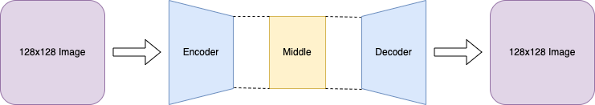
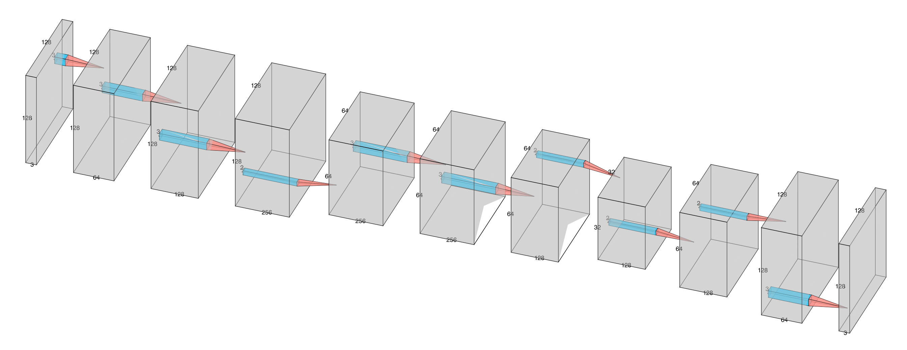
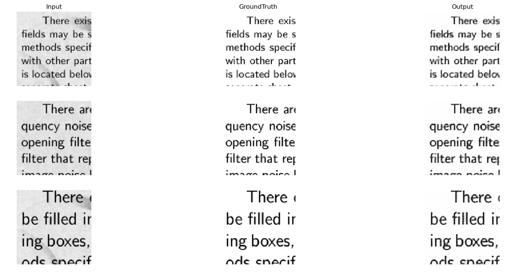

# Text Denoiser
## Introduction  
This denoiser extracts only text from the image by filtering the irrelevant background and noises, using Convolutional Neural Network to extract deep features in an image which includes loads of texts and remove non-text pixels.
## Limitation
This network only accept the input size of 128 X 128. The image over this size might need to be split and then merge. However, this solution makes the final image have some pixel distortion. More reliable solution is still being exploring.   
Colourful text images are not yet tested, currently only grayscale texts are ensured to be valid. Colourful input might produce unwanted result.  
## Dependency  
Pytorch 2.5
## Network Structure

### Encoder-Decoder Structure
 
### Network Layers

## Demo

## LICENSE
This project is licensed under the Apache License, Version 2.0. See the LICENSE file in the root directory for more details.